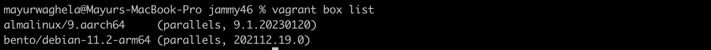

# Tooling Assignment Advanced Template

Provide the required screenshots to show that tooling has been properly installed inside of your Ubuntu Jammy 22.04 Vagrant Box

## Hostname Change

Image goes here


## WebServer Install

Screenshot from the host OS of http://192.168.33.10  or whichever private IP you assign to your Vagrant Box


## MariaDB Version

Execute command: `mysql -V`


## Java Version

Execute command: `java -version`


## Spark Versions

Execute command: `pyspark` and `spark-shell` and take screenshots of each.


## R Version

Execute command: `R -v`


## Python Version

Execute command: `python -V`


## Result of Cloning Your Private Repository

No need to show the clone action -- just the results of the `ls` command

Image goes here


## Output of vagrant box list command

After completing this tutorial take a screenshot of the output of the command ```vagrant box list```


## Deliverable

In the document, tooling-assignment-advanced-template.md, provide the required screenshots. Push a copy of this Markdown file in the private GitHub repo provided, under the itmd-521 folder and make an additional sub-folder named: **tooling-assignments-advanced**.  Submit the URL to your deliverable to Blackboard
